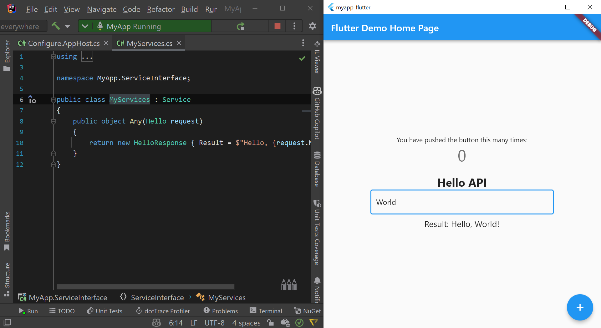
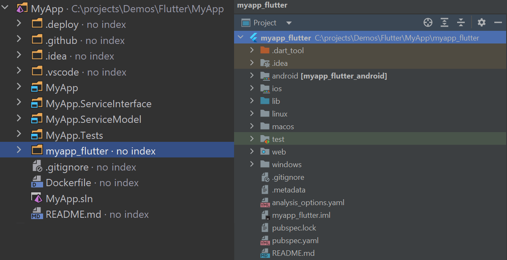
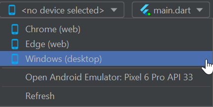
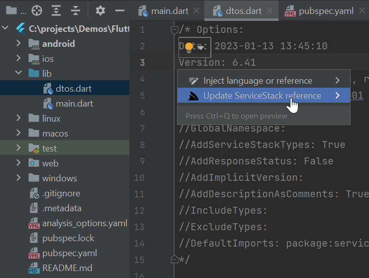

Two mix templates to help you build services with Flutter clients are the `flutter` and `flutter-grpc` mix templates.

In this walk through we will be focusing on `mix flutter` template. See [here for details on `mix flutter-grpc`](./flutter-grpc-mix.md).

<iframe class="video-hd" src="https://www.youtube.com/embed/t4WcXo4Vnio" frameborder="0" allow="autoplay; encrypted-media" allowfullscreen></iframe>

These templates create a new Flutter application using your locally installed [Flutter SDK](https://docs.flutter.dev/get-started/install) that comes wired up to the ServiceStack project template it is mixed into.

These mix templates can be added to ServiceStack templated projects using the [ServiceStack Dotnet X tool](./dotnet-tool.md), which can be installed using the command:

```bash
$ dotnet tool install --global x 
```

## Pre-requisites

- Flutter SDK
- Dart SDK
- ServiceStack dotnet X tool



## New or Existing Project

The Flutter integration works with most ServiceStack templates. It does make the assumption that when working locally, the initial Flutter application will connect to the ServiceStack host via `localhost:5001` or if the client is running on an Android Emulator, `10.0.0.2:5001`.

For example, you could [start with a new](./dotnet-new.md) `web` ServiceStack project to host your web services, and add a working Flutter client using the mix template.

```bash
$ x new web MyApp
```

Then from your new solution directory `MyApp`, mix in the Flutter application using:

```bash
$ x mix flutter
```

## Project Structure

The `x mix flutter` template uses your locally installed Flutter SDK to create the initial Flutter application via the `flutter create` command. 
It then overrides some source files, and adds some required Dart dependencies to facilitate the integration with your web services.



## Running

To develop on your Flutter client, it is best to take advantage of the hot reload functionality of both Flutter and `dotnet watch`.

### ServiceStack App

From your `web` project directory, navigate into your `MyApp` AppHost directory and run:

```bash
$ dotnet watch
```

Keep your services running, and open your `myapp_flutter` directory using [Android Studio](https://developer.android.com/studio/install).

### Flutter App

When building application in flutter, you can use various [IDEs or editors](https://docs.flutter.dev/get-started/editor?tab=androidstudio), but in this example we will be using Android Studio.
Flutter applications are written in the [Dart Language](https://dart.dev/overview), and since both are developed by Google, there are great resources for [learning both the Dart Language](https://dart.dev/guides), and the [Flutter Framework](https://docs.flutter.dev/reference/tutorials), included [dedicated resources for those familiar with Xamarin.Forms](https://docs.flutter.dev/get-started/flutter-for/xamarin-forms-devs).

When developing on Windows, Android Studio will automatically support `web` and `desktop` targets, as well as making it easier to set up and manage Android Emulated devices.



## Development

From Android Studio, you can target multiple platforms including Windows, Web and Android. If you are on Windows, targeting a Windows Desktop application can provide a rapid development cycle as Flutter Hot Reload works well and performs quickly.
And since ServiceStack can generate client [Data Transfer Objects](http://msdn.microsoft.com/en-us/library/ff649585.aspx) or DTOs, we can have a [typed end-to-end service integration](./add-servicestack-reference) when developing Flutter client applications.

### Flutter `main.dart`

The `x mix flutter` command provides a customized `main.dart` with a built-in integration of the `Hello` API service of your local ServiceStack application.

This uses the `servicestack` Dart package which contains a supported [Service Client](./clients-overview). To support both web and non-web client targets, a `ClientFactory` is used with a conditional import of the platform specific service client from `servicestack/web_client.dart` for web, and `servicestack/client.dart` for all native platforms. 

```dart
var baseUrl = "https://localhost:5001";
var clientOptions = ClientOptions(baseUrl: baseUrl);

client = ClientFactory.createWith(clientOptions);
runApp(const MyApp());
```

The use of Android Emulators for local development is catered for by checking if the application is not in release mode, is not a web platform and if it is running on the Android platform.

```dart
if (!kReleaseMode && !kIsWeb) {
  if (Platform.isAndroid) {
    clientOptions.baseUrl = "https://10.0.2.2:5001";
    clientOptions.ignoreCertificatesFor.add(clientOptions.baseUrl);
  }
}
```

This is done since Android Emulators have limited network access, and can only access the ServiceStack application running on the host. Android can only communicate with the host via the [aliased `10.0.2.2` IP address from the running emulator](https://developer.android.com/studio/run/emulator-networking).

### Flutter Template Overview

Flutter applications use [`Widgets`](https://docs.flutter.dev/development/ui/widgets-intro) to build everything you see in a Flutter application. 

> Widgets describe what their view should look like given their current configuration and state. When a widget’s state changes, the widget rebuilds its description, which the framework diffs against the previous description in order to determine the minimal changes needed in the underlying render tree to transition from one state to the next.

The `MyApp` widget is the entry point of our application, and the `MaterialApp` to default your Flutter application to use [Material Design](https://docs.flutter.dev/development/ui/material) as a style or theme.

```dart
class MyApp extends StatelessWidget {
  const MyApp({super.key});

  // This widget is the root of your application.
  @override
  Widget build(BuildContext context) {
    return MaterialApp(
      title: 'Flutter Demo',
      theme: ThemeData(
        primarySwatch: Colors.blue,
      ),
      home: const HelloFlutter(title: 'Flutter Demo Home Page'), // Your app starts here
    );
  }
}
```

The `HelloFlutter` widget is a [`StatefulWidget`](https://api.flutter.dev/flutter/widgets/StatefulWidget-class.html) which references the `HelloFlutterState` class where the UI is declared and updates are made to the Flutter UI.

The example application listens for changes from the `TextField` using a `TextEditingController`, binding a `callService` method which fires whenever a change is made.

```dart
class HelloFlutterState extends State<HelloFlutter> {
  //State for this widget
  String result = "";
  var myController = TextEditingController();
  ...

  @override
  void initState() {
    super.initState();
    // Listen for changes from the TextField and call our API
    myController.addListener(callService);
  }
  
  void callService() async {
    var text = myController.text.isEmpty ? "World" : myController.text;
    var response = await client.get(Hello(name: text));
    setState(() {
      result = response.result!;
    });
  }
  
@override
  Widget build(BuildContext context) {
    return Scaffold(//...
      body: Center(//..
        TextField(//..
          controller: myController,
      )
```

### Calling the Hello API

The `callService` method is an `async` method where Dart has a familiar syntax to dotnet. The generated Request and Response DTOs located in the `dtos.dart` file represent the same messages on our ServiceStack server, so we also get similar syntax and types when compared to calling from a dotnet client.

```dart
  void callService() async {
    var text = myController.text.isEmpty ? "World" : myController.text;
    var response = await client.get(Hello(name: text)); // response of type `HelloResponse`.
    setState(() {
      result = response.result!;
    });
  }
```

### Updating your client DTOs

During development of your web services, when changes are made to your Request DTO classes, your client sometimes needs to be aware of these changes.
Your client DTOs in the `lib/dtos.dart` file can be regenerated while your ServiceStack application is running by using the Servicestack dotnet x tool:

```bash
$ x dart
```

If you use Android Studio, there is also a ServiceStack IDEA Plugin for Jetbrains IDEs that can make it easy to quickly update your client DTOs.



::: info
To install the Plugin goto `Settings`->`Plugins`->Search Marketplace for `ServiceStack`.
:::

The `dtos.dart` file that comes with the Flutter `mix` template only contains DTOs for the default Hello service, but if other web services are running on your host application, updating your `dtos.dart` file using one of the above methods will then sync your client and server Request DTOs. 

For example, if you use one of our [Jamstack templates](https://jamstacks.net), there is also a Todo service. 

Running `x dart` in project terminal will update our DTOs, and we can query for `Todo` items using the following Dart syntax.

```dart
Future<QueryResponse<Todo>> queryTodos() async {
    return await client.get(QueryTodos());
}
```

The `Todo` is a shared model type, so we can use them in our application passing around the same data structure.

```dart
Future<Todo> updateTodo(Todo item) async {
    return await client.put(UpdateTodo(
        id: item.id,
        isFinished: (item.isFinished ?? false) ? true : false,
        text: item.text));
}
```

We've made an example codebase called [BookingsFlutter](https://github.com/NetCoreApps/BookingsFlutter) to show a more featured cross-platform application integrating with different types of services.

[](https://github.com/NetCoreApps/BookingsFlutter)

### Questions?

Head over to our [Customer Forums](https://forums.servicestack.net) or [GitHub Discussions](https://servicestack.net/ask) if you are having issues or have any questions!